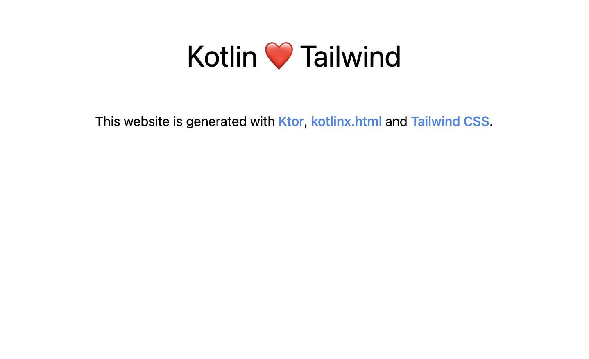

# Ktor with Tailwind

A sample Ktor application with kotlinx.html HTML templating and Tailwind.

## Highlights

- The project uses [Tailwind CLI](https://tailwindcss.com/docs/installation) to generate a stylesheet that consists only of the css classes referenced in the Kotlin code.
  - This results in much smaller stylesheet size compared to directly using the [Tailwind CDN](https://tailwindcss.com/docs/installation/play-cdn).
- The `tailwindcss` cli is executed as part of the Gradle build with `node-gradle` plugin. See the custom `NpxTask` task in [build.gradle.kts](build.gradle.kts).   
- [tailwind.config.js](tailwind.config.js) configures a path to the source files which the tailwind cli scans when generating the stylesheet.
  - There is no additional magic needed even though the source files are written in Kotlin: the default config works almost out-of-the box in simple scenarios.
- The page contents are defined in [Application.kt](src/main/kotlin/example/com/Application.kt).

## How to run

Run the project with

`./gradlew run`

As part of the Gradle build, the Tailwind CLI gets executed, resulting in `styles.css` file under static/ folder.

Open your favourite browser and head to `http://localhost`.

